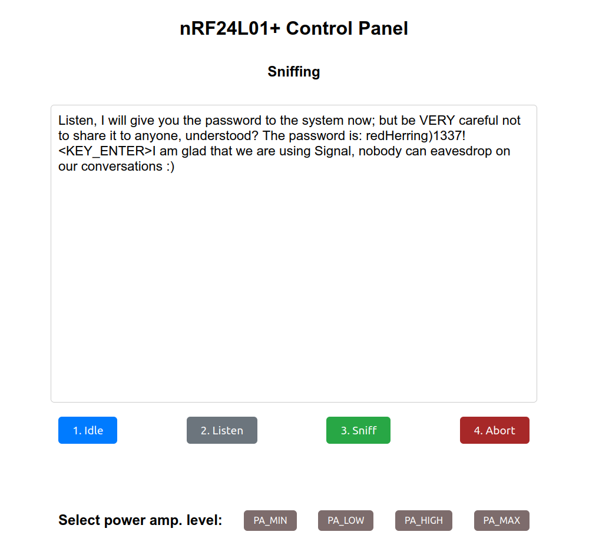

# nRF24L01-eavesdropping

This project is based on the thesis that I have written at University of Wrocław. Thesis investigates the vulnerabilities in Microsoft Wireless Keyboard 800 communications due to insufficient encryption. It demonstrates the exploitation of these vulnerabilities using a Raspberry Pi Zero 2W, an nRF24L01+ transceiver, and a custom-built software application written in Python and Flask, utilizing WebSockets (socket.io) and a StateMachine design.

## Table of Contents

- [Introduction](#introduction)
- [Features](#features)
- [Hardware Requirements](#hardware-requirements)
- [Software Requirements](#software-requirements)
- [Installation](#installation)
- [Usage](#usage)
- [App Screenshot](#app-screenshot)
- [Acknowledgements](#acknowledgements)

## Introduction

The objective of this project is to demonstrate the security vulnerabilities in Microsoft Wireless Keyboard 800 due to weak encryption mechanisms. The project identifies two critical vulnerabilities:
1. A design flaw in the NRF24LE1H chip revealing the keyboard's MAC address.
2. Incorrect implementation of Vernam encryption using the MAC address as the key.

By exploiting these vulnerabilities, the project shows how an attacker can eavesdrop on wireless keyboard communications and capture typed text.

## Features

- Real-time capturing of keyboard communication packets.
- Decryption of captured packets to reveal typed text.
- Web-based interface to monitor and control the attack.
- Utilizes Flask, eventlet's WSGI server and socket.io for real-time communication.
- StateMachine design for handling different states of the attack process.

## Hardware Requirements

- Raspberry Pi Zero 2W
- nRF24L01+ transceiver module
- MicroSD card (minimum 8GB)
- Power supply/powerbank for Raspberry Pi

## Software Requirements

- Python 3.x
- Flask
- Flask-SocketIO
- PyNRF24
- pigpiod

## Installation

1. **Set up the Raspberry Pi Zero 2W:**
   - Install Raspberry Pi OS on the MicroSD card.
   - Boot the Raspberry Pi and connect to the internet.

2. **Install required software:**
   ```bash
   sudo apt-get update
   sudo apt-get install python3-pip pigpio python-pigpio python3-pigpio
   sudo pip3 install eventlet Flask Flask-SocketIO nrf24
   ```

3. **Clone the repository:**
   ```bash
   git clone https://github.com/tTargiel/nRF24L01-eavesdropping
   cd nRF24L01-eavesdropping
   ```

4. **Connect the nRF24L01+ transceiver module to the Raspberry Pi:**
   - Follow the wiring diagram provided in the documentation.

## Usage

1. **Run the application:**
   ```bash
   python3 app.py
   ```

2. **Access the web interface:**
   - Open a web browser and go to http://<RaspberryPi_IP>:5000

3. **Monitor and control the attack:**
   - Use the web interface to start capturing packets, view decrypted text, and manage the attack process.

## App Screenshot



## Acknowledgements

- Thanks to Thorsten Schroeder and Max Moser from remote-exploit.org for their KeyKeriki project.
- Gratitude to Travis Goodspeed for his insightful blog post "Promiscuity is the nRF24L01+'s Duty".
- Appreciation to Bjarne Hansen for his py-nrf24 Python library.
- Special thanks to all my friends who helped me with the project and people from the University of Saarland who showed their interest in my work.

---

**Disclaimer:** This project is for educational and research purposes only. Any misuse of this project for illegal activities is strictly prohibited. Use responsibly and respect privacy and data protection laws.
